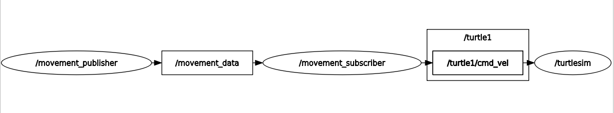

# ROS2 package for movement data subscriber node

## Node Info

This node is a subscriber node working side-by-side with [this publisher node](https://github.com/brianle169/movement_pub). 

Besides operating only as a subscriber that receive and print data to console, this node will also transform the given data in `custom_interfaces/msg/CircleMovement` into `geometry_msgs/msg/Twist`, then publish the newly transformed data to the `cmd_vel` topic of `turtlesim` node.

The `rqt_graph` representation of this node, along with `movement_publisher` and `turtlesim` is as follow:

